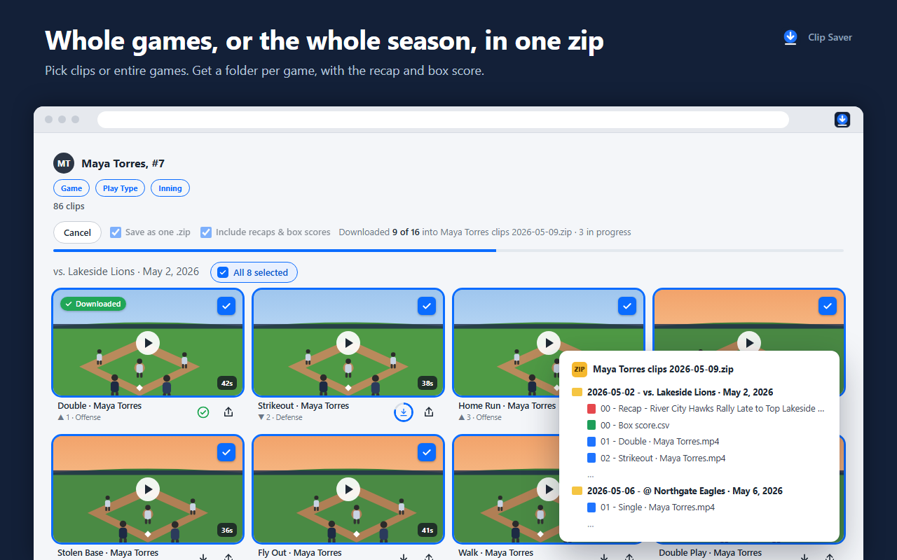
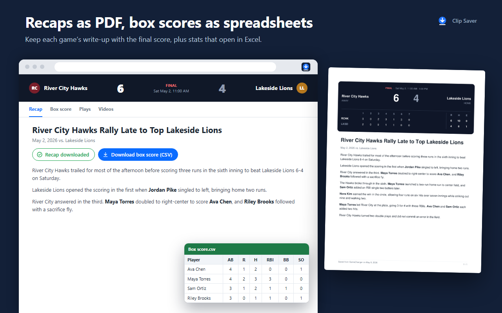

Earlier this week my parents asked me to help them figure out how to download videos off the website GameChanger.

## What is GameChanger?

If you are not familiar with GameChanger, it is an application that (simply put):

1. Tracks the stats of teams and players for a bunch of different sports.
2. Stores a game's highlights (generally broken down by player).
3. Creates an AI write-up at the end of the game summarizing important stats or events.

## No download button?

As I leaned over my Mom's shoulder expecting this task to be a quick explanation, I could not believe what I was seeing...there was no download button in sight! The website doesn't let you download anything at all. The mobile app does have a "Share Clip" option that lets you save a clip to your phone, but it takes about 45 seconds to prepare and only works one clip at a time (and on Android it can only go to Google Photos or Google Drive). That's fine for one home run, but not so fun for a whole season. For full game footage, GameChanger's own help page recommends screen recording it. I don't fully understand why GameChanger would not have better downloading built into their app; if I had to guess, they would prefer that more people are enticed to create their own account.

Looking for a workaround, I stumbled across this [Reddit post](https://www.reddit.com/r/Homeplate/comments/1quboij/i_got_tired_of_not_being_able_to_download_my_kids/) from someone who created a Chrome extension that adds a download button to GameChanger, allowing easy downloading without the need for screen recording. At first I thought it was exactly what I was looking for, but after downloading it I realized it only lets you download 3 videos a week before you have to "upgrade" to the "pro" version (to be fair, if I had not skimmed the Reddit post, I would have seen that the creator mentioned this limitation). Paying a subscription to download my own family's highlights didn't sit right with me, and I realized this was something perfect for my good friend Claude to help out with (I later discovered this [hilarious comment](https://www.reddit.com/r/Homeplate/comments/1quboij/comment/o3o5xa8/) that encapsulated my thoughts quite well).

## Building it

So, I fired up Claude Code and put the new Opus 5.5 model to work. My very first prompt was literally "Are you able to access chrome?" After a little back and forth, version 0.1 was ready in about 15 minutes and allowed a user to save individual clips to their computer. At this point I figured I might as well button it up better, so next I (Claude) added some QoL features: selecting multiple clips at once, selecting an entire game's clips, a download all button, a recap PDF generator, a box score CSV, and a zip folder structure to separate different games.

The end result is **Clip Saver for GameChanger (Unofficial)**. By the numbers, it came out to about 2,700 lines of code over 11 commits, all between Saturday evening and Sunday evening (not counting the two libraries it bundles for the video and PDF work). Everything runs right in your browser: the video conversion, the PDFs, the spreadsheets, all of it. There's no server anywhere, no account, and no tracking; your download history just stays on your own computer.

When you download a whole season, it writes the zip straight to your hard drive as each clip finishes instead of holding everything in memory.

## The bugs

It was pretty much smooth sailing, but there were a few hiccups along the way:

- **The 13-hour clip.** The first clip I downloaded played fine in Chrome, but Windows Media Player said it was 13 hours, 15 minutes and 19 seconds long...for a one-minute clip. Turns out the file had a placeholder where the length should be (0xFFFFFFFF, the biggest number that fits in that spot), and at 90,000 ticks per second that works out to almost exactly 13 hours and 15 minutes. The fix was rebuilding each video as a normal MP4 file with the real length and proper seeking.
- **Two different video formats.** Downloads worked great for one game and completely failed for another. It turns out GameChanger stores some games' clips in one video format and other games' clips in a different one. The extension now checks which one it's dealing with and handles each.
- **Press play to download.** A game's clips wouldn't download until at least one video from that game had been started, so the extension quietly starts (and immediately pauses and mutes) one clip per game before downloading.

## Trying to do it the right way

Before putting this on the store, I had Claude actually read GameChanger's Terms of Use. GameChanger explicitly lets you save clips through their own app, but their terms do restrict automated access. So downloading a single clip is on by default, and the bulk tools (download all, zips, etc.) are opt-in with a note about the terms right next to the switch. I also added "for GameChanger (Unofficial)" to the title and a disclaimer that it's not affiliated with GameChanger at all.

## What's next

I still have some minor improvements I would like to add. Clip Saver only handles highlight clips right now; full game videos aren't supported yet (the account I was using did not have any full games saved, and a file that large would need a different approach than the clips use). If you need full games, there are already some **free**, battle-tested general video downloaders, [Stream Recorder](https://chromewebstore.google.com/detail/stream-recorder-hls-m3u8/iogidnfllpdhagebkblkgbfijkbkjdmm) and [FetchV](https://chromewebstore.google.com/detail/fetchv-video-downloader-f/nfmmmhanepmpifddlkkmihkalkoekpfd) being the two most popular I came across. Just note that on the website, full game videos are only visible to team staff, so those tools can only grab a game if you can already watch it. I would also like to update some of the UI, as the download button is not very obvious to the user.

I paid my $5 fee to register a developer account on the Chrome Web Store, and if all goes well, my extension will be approved soon and everyone will be able to enjoy a **free** improvement to downloading their GameChanger videos!

Once the store approves it, I will add a link here for all to enjoy!

Thanks for reading if you made it this far!

Lukewarmly,

Luke
